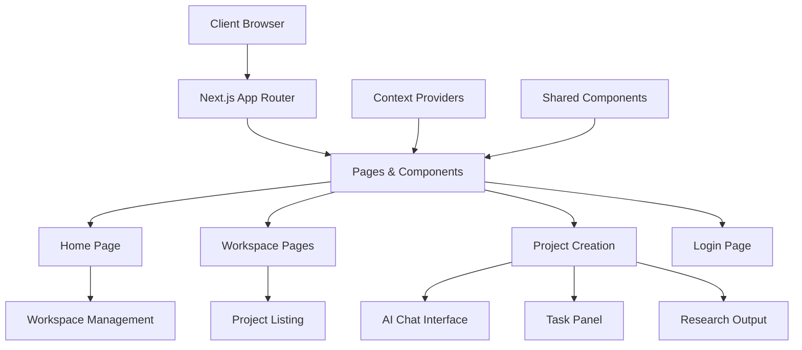

<div align="center">

# 🔬 Research Hub

### *An AI-Powered Research Assistant Application*

[](https://nextjs.org/)
[](https://react.dev/)
[](https://www.typescriptlang.org/)
[](https://tailwindcss.com/)
[](https://opensource.org/licenses/MIT)

<p align="center">
  <strong>Organize your research projects, manage workspaces, and streamline your workflow with an intuitive AI-powered interface.</strong>
</p>

[🚀 Getting Started](#-getting-started) •
[✨ Features](#-features) •
[📸 Screenshots](#-screenshots) •
[🏗️ Architecture](#️-architecture) •
[🤝 Contributing](#-contributing)

---

</div>

## 📋 Table of Contents

- [🚀 Getting Started](#-getting-started)
  - [Prerequisites](#prerequisites)
  - [Installation](#installation)
  - [Running the App](#running-the-app)
- [✨ Features](#-features)
- [📸 Screenshots](#-screenshots)
- [🏗️ Architecture](#️-architecture)
- [📁 Project Structure](#-project-structure)
- [🛠️ Tech Stack](#️-tech-stack)
- [📜 Available Scripts](#-available-scripts)
- [🤝 Contributing](#-contributing)
- [📄 License](#-license)

---

## 🚀 Getting Started

### Prerequisites

Before you begin, ensure you have the following installed:

| Requirement | Version |
|-------------|---------|
| Node.js | >= 18.x |
| npm / yarn / pnpm | Latest |

### Installation

1. **Clone the repository**

   ```bash
   git clone https://github.com/code-tan-uj/req-ease.git
   cd req-ease
   ```

2. **Install dependencies**

   ```bash
   npm install
   # or
   yarn install
   # or
   pnpm install
   ```

3. **Set up environment variables** (if needed)

   ```bash
   cp .env.example .env.local
   ```

### Running the App

```bash
# Development mode (with hot-reload)
npm run dev

# Build for production
npm run build

# Start production server
npm run serve
```

🌐 Open [http://localhost:4028](http://localhost:4028) in your browser to view the application.

---

## ✨ Features

<table>
  <tr>
    <td align="center" width="33%">
      <h3>📁 Workspace Management</h3>
      <p>Create, organize, and manage multiple research workspaces with tags and descriptions</p>
    </td>
    <td align="center" width="33%">
      <h3>🔍 Smart Search</h3>
      <p>Quickly find workspaces and projects with powerful search functionality</p>
    </td>
    <td align="center" width="33%">
      <h3>📊 Project Tracking</h3>
      <p>Track project progress and manage research tasks efficiently</p>
    </td>
  </tr>
  <tr>
    <td align="center" width="33%">
      <h3>🤖 AI-Powered Chat</h3>
      <p>Interactive chat interface for research assistance and project creation</p>
    </td>
    <td align="center" width="33%">
      <h3>🌙 Dark/Light Mode</h3>
      <p>Beautiful UI with theme support for comfortable viewing</p>
    </td>
    <td align="center" width="33%">
      <h3>📱 Responsive Design</h3>
      <p>Seamless experience across desktop, tablet, and mobile devices</p>
    </td>
  </tr>
</table>

### Key Highlights

- ✅ **Modern Stack** - Built with Next.js 15 and React 19
- ✅ **Type-Safe** - Full TypeScript support for robust development
- ✅ **Fast & Optimized** - Server-side rendering and optimized performance
- ✅ **Smooth Animations** - Framer Motion powered transitions
- ✅ **Toast Notifications** - Real-time feedback with react-hot-toast
- ✅ **Charts & Visualization** - Data visualization with Recharts

---

## 📸 Screenshots

<div align="center">

| Home Dashboard | Workspace View |
|:---:|:---:|
| *Manage all your workspaces* | *Detailed workspace projects* |

| Project Creation | Research Output |
|:---:|:---:|
| *AI-powered project setup* | *Organized research results* |

</div>

---

## 🏗️ Architecture



---

## 📁 Project Structure

```
researchhub/
├── 📂 public/                    # Static assets
│   └── assets/images/            # Image assets
├── 📂 src/
│   ├── 📂 app/                   # Next.js App Router
│   │   ├── 📂 home/              # Home dashboard
│   │   │   ├── page.tsx          # Main home page
│   │   │   └── components/       # Home-specific components
│   │   ├── 📂 workspace/         # Workspace management
│   │   │   ├── [id]/             # Dynamic workspace routes
│   │   │   └── components/       # Workspace components
│   │   ├── 📂 project/           # Project views
│   │   │   └── [id]/             # Dynamic project routes
│   │   ├── 📂 project-creation/  # AI-powered project creation
│   │   │   └── components/       # Chat, Tasks, Research panels
│   │   ├── 📂 login/             # Authentication
│   │   ├── layout.tsx            # Root layout
│   │   └── not-found.tsx         # 404 page
│   ├── 📂 components/            # Shared components
│   │   ├── common/               # Header, Footer, Navbar
│   │   └── ui/                   # Reusable UI components
│   ├── 📂 contexts/              # React Context providers
│   └── 📂 styles/                # Global styles
├── 📄 next.config.mjs            # Next.js configuration
├── 📄 tailwind.config.js         # Tailwind CSS configuration
├── 📄 tsconfig.json              # TypeScript configuration
└── 📄 package.json               # Dependencies and scripts
```

---

## 🛠️ Tech Stack

<div align="center">

| Category | Technologies |
|----------|-------------|
| **Framework** |  |
| **Library** |  |
| **Language** |  |
| **Styling** |  |
| **Animations** |  |
| **Charts** |  |
| **Notifications** |  |

</div>

---

## 📜 Available Scripts

| Command | Description |
|---------|-------------|
| `npm run dev` | Start development server on port 4028 |
| `npm run build` | Build for production |
| `npm run start` | Start development server |
| `npm run serve` | Start production server |
| `npm run lint` | Run ESLint |
| `npm run lint:fix` | Fix ESLint errors automatically |
| `npm run format` | Format code with Prettier |
| `npm run type-check` | Run TypeScript type checking |

---

## 🤝 Contributing

Contributions are what make the open source community such an amazing place to learn, inspire, and create. Any contributions you make are **greatly appreciated**.

1. **Fork** the repository
2. **Create** your feature branch (`git checkout -b feature/AmazingFeature`)
3. **Commit** your changes (`git commit -m 'Add some AmazingFeature'`)
4. **Push** to the branch (`git push origin feature/AmazingFeature`)
5. **Open** a Pull Request

### Development Guidelines

- Follow the existing code style
- Write meaningful commit messages
- Update documentation as needed
- Add tests for new features

---

## 📄 License

This project is licensed under the **MIT License** - see the [LICENSE](LICENSE) file for details.

---

<div align="center">

### ⭐ Star this repo if you find it helpful!

Made with ❤️ by [code-tan-uj](https://github.com/code-tan-uj)

[](https://github.com/code-tan-uj)

</div>
